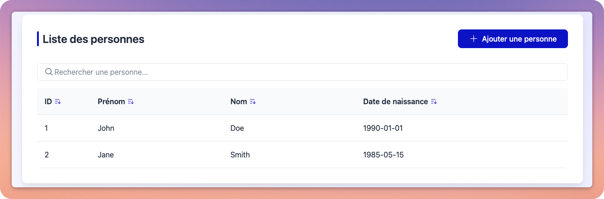

# Person Front

A modern Angular application for managing person records with a clean, responsive interface.



## Overview

Person Front is a comprehensive CRUD (Create, Read, Update, Delete) application built with Angular 19 that allows users to manage person records. The application provides an intuitive interface for listing, viewing, creating, and editing person information including personal details such as name, date of birth, place of birth, and nationality.

## Features

- **Person Listing**: View all person records in a sortable, filterable list
- **Person Details**: View detailed information for a specific person
- **Person Creation**: Add new person records with validation
- **Person Editing**: Modify existing person records
- **Responsive Design**: Works seamlessly on desktop and mobile devices
- **Modern UI**: Clean interface using the Helix design system

## Technology Stack

- **Framework**: Angular 19
- **UI Components**: @ps/helix design system
- **Icons**: Phosphor Icons
- **Date Handling**: date-fns
- **State Management**: RxJS

## Data Structure

Each person record contains the following information:

- Unique identifier
- First name
- Last name
- Date of birth
- City of birth
- Country of birth
- Nationality

## Getting Started

### Prerequisites

- Node.js (v18 or later recommended)
- npm (v9 or later recommended)

### Installation

1. Clone the repository:
   ```bash
   git clone https://github.com/PACK-Solutions/person-front.git
   cd person-front
   ```

2. Install dependencies:
   ```bash
   npm install
   ```

3. Start the development server:
   ```bash
   npm start
   ```

4. Open your browser and navigate to `http://localhost:4200`

## Building for Production

To create a production build:

```bash
npm run build
```

The build artifacts will be stored in the `dist/` directory.

## Testing

### Running Unit Tests

```bash
npm test
```

## Development

This project was generated with [Angular CLI](https://github.com/angular/angular-cli) version 19.0.6.

### Code Scaffolding

To generate a new component:

```bash
ng generate component component-name
```

For other available schematics:

```bash
ng generate --help
```

## Additional Resources

- [Angular Documentation](https://angular.dev)
- [Angular CLI Documentation](https://angular.dev/tools/cli)
- [Helix Design System](https://example.com/helix) (if publicly available)

## Exercise

- Add the avatar component in the detail person component: [PS Helix Avatar](http://prd-git01.packsolutions.local/development/ps-helix/-/blob/main/src/lib/components/avatar/avatar.md?ref_type=heads)
- Modify the `person.service.ts` to interact with the person-api
- Bind the avatar to the api avatar base 64 image (tip: suffix the base 64 with: `data:image/png;base64,`)
- Setup [Playwright](https://playwright.dev) for end-to-end testing
  1. Install [playwright-ng-schematics](https://github.com/playwright-community/playwright-ng-schematics): `ng add playwright-ng-schematics`
  2. Write your first e2e test
  3. Install Playwright Vscode plugin [Playwright Vscode plugin](https://playwright.dev/docs/getting-started-vscode)
  4. Run the tests
     `ng e2e --ui`
     or
     `npm run e2e -- --ui`

## Contributors

- Initial development team
  - Fabrice Perez
  - Richard Capraro
